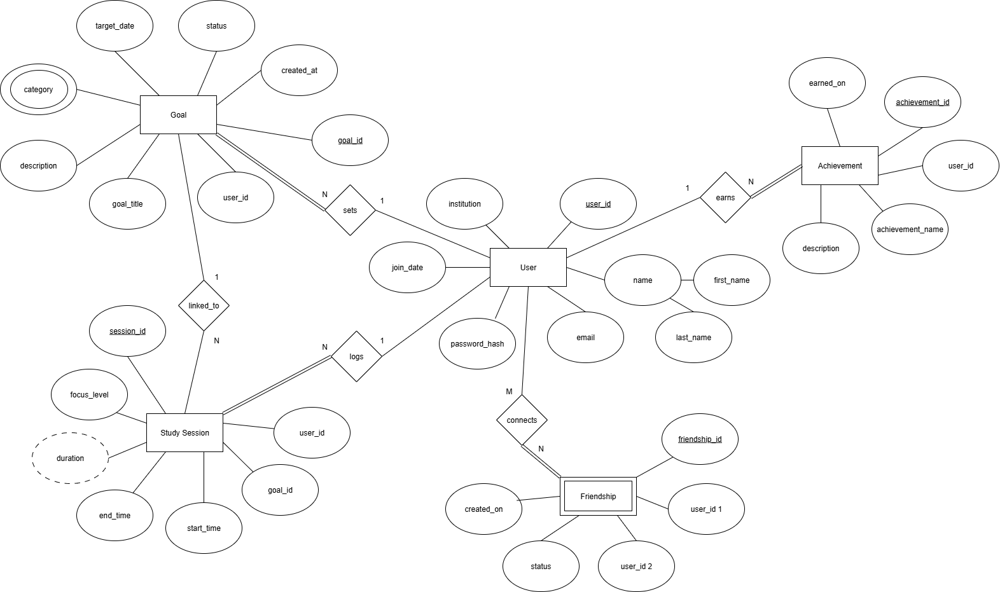
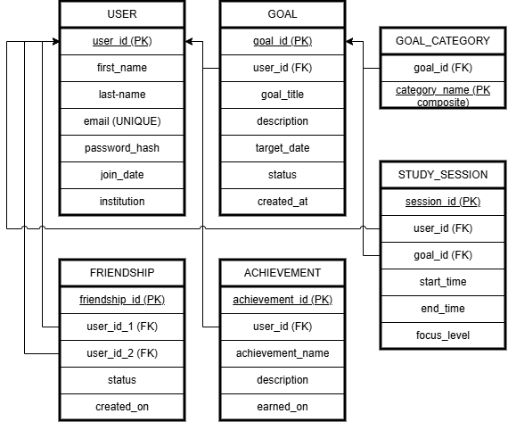

# Study Buddy

## 📄 Overview
This project demonstrates the design and implementation of a DBMS Project using SQL concepts to develop a collaborative study and goal tracking platfom for the aid of students.

---

## 🏗️ Features & Components

### 1. **Database Design**
- **ER Diagram** – Conceptual representation of entities, attributes, and relationships.  
- **Relational Schema** – Logical structure showing tables, primary/foreign keys, and constraints.

### 2. **Data Definition Language (DDL)**
Includes SQL scripts for:
- Creating and dropping tables
- Defining constraints (Primary Key, Foreign Key, Unique, Check)
- Setting up relationships between entities

### 3. **Data Manipulation Language (DML)**
Scripts for:
- Inserting, updating, and deleting records  
- Sample datasets to test the schema

### 4. **Triggers**
Implements automatic actions based on specific database events such as:
- Logging changes  
- Maintaining data consistency  
- Auditing user operations

### 5. **Stored Procedures**
Reusable SQL blocks designed for:
- Automating repetitive database operations  
- Improving modularity and performance  

### 6. **Functions**
User-defined functions that:
- Perform calculations or transformations  
- Return single values or derived results from queries  

---

## 🖼️ Diagrams

### 📊 ER Diagram

### 🧩 Relational Schema

---

## 👩‍💻 Contributors
- Shubhangi Srivastava (PES2UG23CS572)
- Siri Basavaraj (PES2UG23CS582)

---
